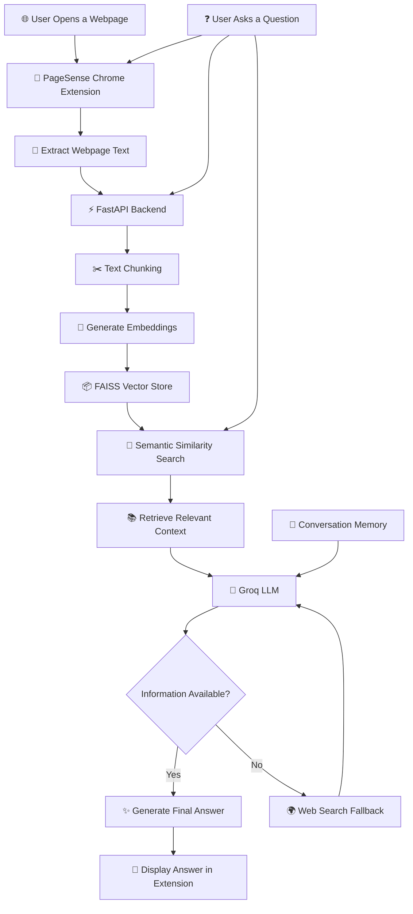
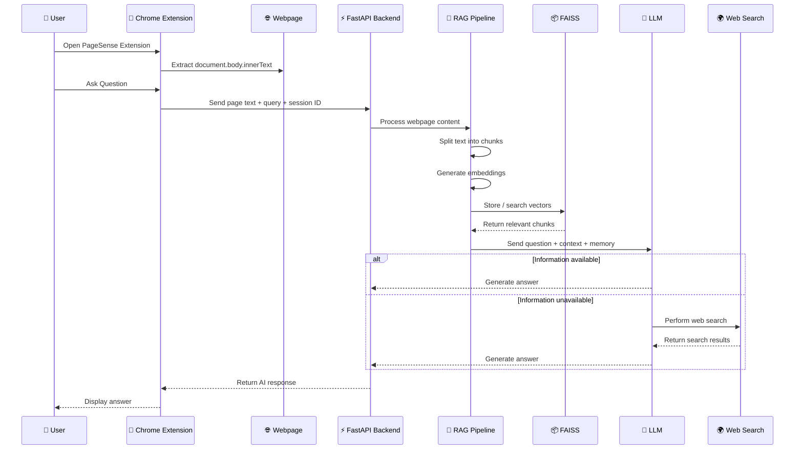
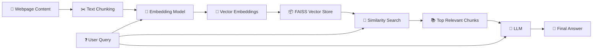
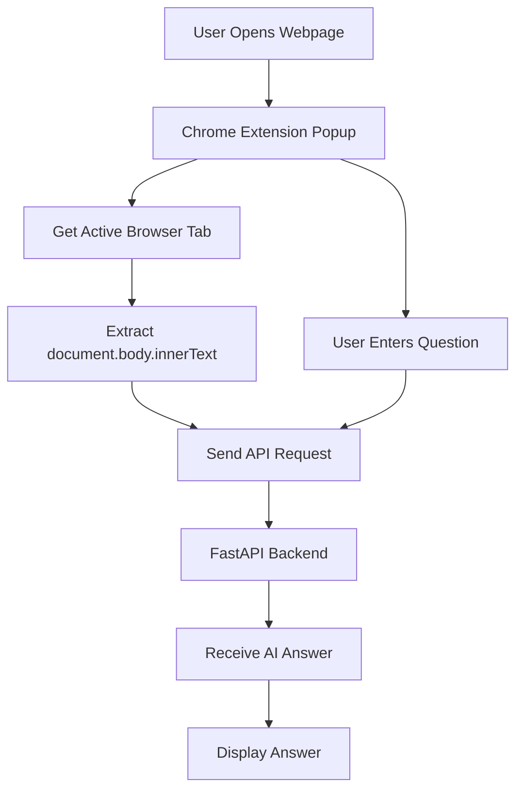
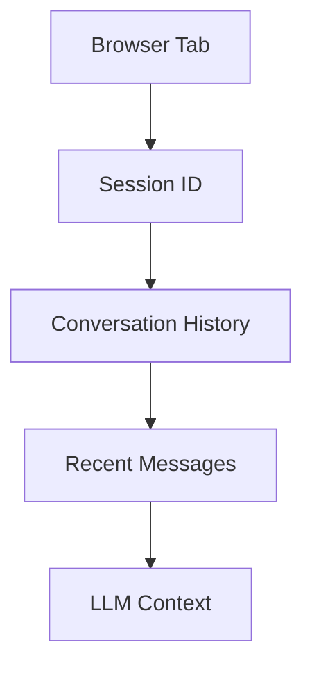
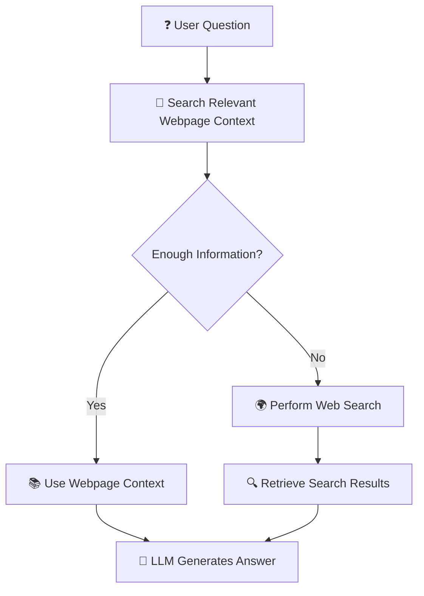
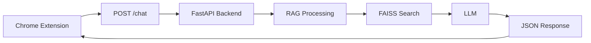
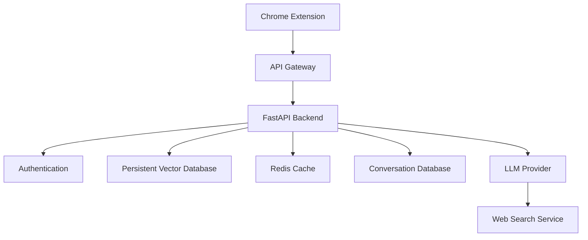

# 🚀 PageSense — Chat With Any Webpage Using AI

> **An AI-powered Chrome extension that lets users understand, summarize, and interact with any webpage using Retrieval-Augmented Generation (RAG), semantic search, conversational memory, and LLM-powered answers.**

<p align="center">


</p>

---

## 🌟 Overview

**PageSense** is an AI-powered Chrome extension that transforms any webpage into an interactive knowledge source.

Instead of manually reading long articles, documentation, blogs, research content, or educational webpages, users can simply open the extension and ask questions about the page.

### Example questions

* ❓ *What is this page about?*
* 📝 *Summarize this webpage.*
* 🔍 *What are the most important points?*
* 🧠 *Explain this topic in simple words.*
* 📚 *What does this article say about a specific topic?*
* 💬 *Can you explain the second point in more detail?*

The extension extracts the content of the currently active webpage and sends it to a backend powered by **FastAPI**.

The backend uses a **Retrieval-Augmented Generation (RAG) pipeline** to:

1. Extract and process webpage content.
2. Split the content into smaller chunks.
3. Convert text into vector embeddings.
4. Store embeddings in a FAISS vector index.
5. Retrieve the most relevant information for a user's question.
6. Send the relevant context to an LLM.
7. Generate a context-aware response.

If the webpage does not contain enough information, the system can use a **web search fallback**.

---

# ✨ Features

* 🌐 Chat with any open webpage.
* 📄 Automatically extract webpage content.
* 🤖 AI-powered question answering.
* 🔎 Retrieval-Augmented Generation (RAG).
* 🧠 Semantic search using embeddings.
* 📦 FAISS vector similarity search.
* 💬 Multi-turn conversations.
* 🗂️ Session-based memory for different browser tabs.
* 🔍 Web search fallback.
* ⚡ FastAPI backend.
* 🧩 Chrome Extension built with Manifest V3.
* 🚀 Fast LLM inference using Groq.
* 🔗 Context-aware answers based on webpage content.

---

# 🏗️ System Architecture



---

# 🔄 Application Workflow



---

# 🧠 RAG Pipeline

The core of PageSense is a **Retrieval-Augmented Generation (RAG) pipeline**.



---

# 🧩 Chrome Extension Workflow



---

# 💬 Conversation Memory

PageSense supports **multi-turn conversations**.

This allows users to ask follow-up questions without repeating the entire context.

### Example

```text
User: What is this webpage about?

AI: This webpage explains Retrieval-Augmented Generation.

User: Explain the second point in more detail.

AI: The second point refers to...
```

Conversation history is maintained using session-based memory.



Each browser tab can maintain its own conversation context.

```text
Tab 1
│
├── User Question 1
├── AI Answer 1
├── User Question 2
└── AI Answer 2


Tab 2
│
├── User Question 1
├── AI Answer 1
└── User Question 2
```

This helps prevent conversations from different webpages from interfering with each other.

---

# 🌍 Web Search Fallback

The primary goal of PageSense is to answer questions using the information available on the current webpage.

However, some user questions may require information that is not present on the page.

In such situations, the system can use web search as a fallback.



This provides a hybrid approach:

```text
                USER QUESTION
                      │
                      ▼
            ┌──────────────────┐
            │  Webpage Context │
            └────────┬─────────┘
                     │
          ┌──────────▼──────────┐
          │ Information enough? │
          └──────┬────────┬─────┘
                 │        │
               YES        NO
                 │        │
                 ▼        ▼
           RAG Answer  Web Search
                 │        │
                 └────┬───┘
                      ▼
                FINAL ANSWER
```

---

# ⚙️ How It Works

## Step 1 — Open a Webpage

The user visits any webpage.

For example:

* 📰 News articles
* 📚 Documentation
* 📝 Blogs
* 🎓 Educational content
* 🔬 Research pages
* 📖 Wikipedia pages

---

## Step 2 — Extract Webpage Content

The Chrome extension extracts the visible text from the currently active webpage.

```javascript
document.body.innerText
```

The extracted content is then prepared to be sent to the backend.

---

## Step 3 — Ask a Question

The user enters a natural language question.

Example:

```text
Summarize this webpage in simple words.
```

The extension sends the following data to the backend:

```json
{
  "text": "Extracted webpage content...",
  "query": "Summarize this webpage in simple words.",
  "session_id": "browser_tab_id"
}
```

---

## Step 4 — Text Chunking

A webpage can contain thousands of words.

Sending the entire webpage directly to an LLM is inefficient and may exceed context limitations.

Therefore, the webpage content is divided into smaller chunks.

```text
Large Webpage
      │
      ▼
┌─────────────┐
│   Chunk 1   │
└─────────────┘
      │
      ▼
┌─────────────┐
│   Chunk 2   │
└─────────────┘
      │
      ▼
┌─────────────┐
│   Chunk 3   │
└─────────────┘
      │
      ▼
     ...
```

This makes semantic retrieval more efficient.

---

## Step 5 — Generate Embeddings

Each text chunk is converted into a vector representation using:

```text
BAAI/bge-small-en
```

Embeddings allow the system to compare text based on **semantic meaning**.

For example:

```text
"Explain artificial intelligence"

        ≈

"What is AI?"
```

Even though the exact words are different, embeddings help the system understand that the questions are semantically related.

---

## Step 6 — Store Vectors in FAISS

The generated embeddings are indexed using **FAISS**.

```text
Webpage Content
       │
       ▼
   Text Chunks
       │
       ▼
   Embeddings
       │
       ▼
FAISS Vector Index
```

FAISS enables fast similarity search across webpage content.

---

## Step 7 — Retrieve Relevant Context

When the user asks a question:

```text
"What are the advantages of RAG?"
```

The system searches the vector index and retrieves the most relevant text chunks.

```text
User Question
      │
      ▼
Embedding
      │
      ▼
Similarity Search
      │
      ▼
Relevant Webpage Chunks
```

Only the most relevant context is sent to the LLM.

---

## Step 8 — Generate AI Response

The LLM receives:

* User question
* Retrieved webpage context
* Conversation history

```text
┌────────────────────────────┐
│      User Question         │
├────────────────────────────┤
│ Relevant Webpage Context   │
├────────────────────────────┤
│ Conversation Memory        │
└──────────────┬─────────────┘
               │
               ▼
          ┌─────────┐
          │   LLM   │
          └────┬────┘
               │
               ▼
         AI Generated
            Answer
```

The answer is then returned to the Chrome extension.

---

# 🛠️ Technology Stack

| Category               | Technology                   |
| ---------------------- | ---------------------------- |
| 🧩 Browser Extension   | Chrome Extension Manifest V3 |
| 🎨 Extension UI        | HTML, CSS, JavaScript        |
| ⚡ Backend              | Python                       |
| 🚀 API Framework       | FastAPI                      |
| 🤖 LLM Provider        | Groq                         |
| 🧠 Language Model      | Llama 3.3 70B                |
| 🔎 RAG Framework       | LangChain                    |
| 🔢 Embedding Model     | BAAI/bge-small-en            |
| 📦 Vector Search       | FAISS                        |
| 🌍 Web Search          | DuckDuckGo                   |
| 💬 Conversation Memory | Python `deque`               |

---

# 📁 Project Structure

> Update this section if your exact folder names are different.

```text
siriousverse/
│
├── backend/
│   │
│   ├── main.py
│   ├── requirements.txt
│   └── .env
│
├── extension/
│   │
│   ├── manifest.json
│   ├── popup.html
│   ├── popup.js
│   └── popup.css
│
├── .gitignore
│
└── README.md
```

---

# 📡 API Architecture



### Request Example

```json
{
  "text": "Content extracted from the webpage...",
  "query": "What is the main topic of this page?",
  "session_id": "123"
}
```

### Response Example

```json
{
  "answer": "The main topic of this webpage is..."
}
```

---

# 🚀 Installation

## 1. Clone the Repository

```bash
git clone https://github.com/kashis9726/siriousverse.git
cd siriousverse
```

---

## 2. Create a Virtual Environment

### Windows

```bash
python -m venv venv
venv\Scripts\activate
```

### macOS / Linux

```bash
python3 -m venv venv
source venv/bin/activate
```

---

## 3. Install Dependencies

Navigate to the backend directory if required:

```bash
cd backend
```

Install dependencies:

```bash
pip install -r requirements.txt
```

---

# 🔐 Environment Variables

Create a `.env` file inside the backend directory:

```env
GROQ_API_KEY=your_groq_api_key_here
```

> ⚠️ **Never upload your `.env` file or API keys to GitHub.**

Add the following to `.gitignore`:

```gitignore
# Environment variables
.env

# Python virtual environments
venv/
.venv/

# Python cache
__pycache__/
*.py[cod]

# IDE settings
.vscode/
.idea/

# OS files
.DS_Store
Thumbs.db
```

---

# ▶️ Running the Backend

Start the FastAPI server:

```bash
uvicorn main:app --reload
```

The backend should run locally at:

```text
http://127.0.0.1:8000
```

FastAPI interactive documentation:

```text
http://127.0.0.1:8000/docs
```

---

# 🧩 Loading the Chrome Extension

1. Open **Google Chrome**.
2. Navigate to:

```text
chrome://extensions/
```

3. Enable **Developer Mode**.
4. Click **Load unpacked**.
5. Select the extension folder.
6. Open any webpage.
7. Click the **PageSense extension**.
8. Ask a question about the webpage.

---

# 🧪 Example Usage

### Scenario

You open a long technical article about **Artificial Intelligence**.

Instead of reading the complete article, open PageSense and ask:

```text
Explain this article in simple words.
```

You can then continue asking:

```text
What are the three most important points?
```

Followed by:

```text
Explain the second point with an example.
```

The system uses:

* Webpage context
* Semantic retrieval
* Conversation memory

to provide contextual answers.

---

# 🎯 Key Concepts Demonstrated

This project demonstrates practical implementation of:

* 🤖 Large Language Models (LLMs)
* 🧠 Retrieval-Augmented Generation (RAG)
* 🔢 Text embeddings
* 🔎 Semantic similarity search
* 📦 Vector databases / vector search
* ⚡ FastAPI backend development
* 🧩 Chrome Extension development
* 🔗 API integration
* 💬 Multi-turn conversations
* 🗂️ Session management
* 🛠️ LLM tool calling
* 🌍 Web search fallback
* 🤖 Agentic AI workflows

---

# 🔮 Future Improvements

* [ ] Cache webpage embeddings instead of rebuilding the index.
* [ ] Add persistent vector storage.
* [ ] Support PDF and document chat.
* [ ] Add source citations in AI responses.
* [ ] Stream responses from the LLM.
* [ ] Save chat history.
* [ ] Improve webpage content extraction.
* [ ] Add support for dynamic and JavaScript-heavy webpages.
* [ ] Add webpage summarization mode.
* [ ] Add browser-side page highlighting.
* [ ] Support multiple LLM providers.
* [ ] Add authentication and user accounts.
* [ ] Deploy the backend to production.
* [ ] Publish the extension to the Chrome Web Store.

---

# 🧠 Future Production Architecture



---

# 📊 Current vs Future Architecture

| Current Prototype         | Future Production Version     |
| ------------------------- | ----------------------------- |
| In-memory processing      | Persistent processing         |
| Temporary FAISS index     | Persistent vector database    |
| Local conversation memory | Database-backed memory        |
| Single backend instance   | Scalable API infrastructure   |
| Local development         | Cloud deployment              |
| Manual extension loading  | Chrome Web Store distribution |

---

# 🧑‍💻 Learning Outcomes

Through this project, I gained practical experience with:

```text
Chrome Extension Development
        +
FastAPI Backend Development
        +
Retrieval-Augmented Generation
        +
Embeddings & Semantic Search
        +
FAISS Vector Indexing
        +
LLM Integration
        +
Conversational Memory
        +
Web Search Tool Calling
        =
Full-Stack AI Application Development
```

---

# 🤝 Contributing

Contributions, suggestions, and improvements are welcome.

### 1. Fork the repository

### 2. Create a feature branch

```bash
git checkout -b feature/new-feature
```

### 3. Make your changes

### 4. Commit your changes

```bash
git commit -m "Add new feature"
```

### 5. Push the branch

```bash
git push origin feature/new-feature
```

### 6. Open a Pull Request

---

# 📄 License

This project is licensed under the MIT License.

---

# 👨‍💻 Author

## kashis makwana

**AI & Software Development Enthusiast**

* GitHub: https://github.com/kashis9726

---

<p align="center">

### ⭐ If you found this project interesting, consider giving the repository a star!

**Built with 🧠 AI, ⚡ FastAPI, 🔎 RAG, and 🧩 Chrome Extensions**

</p>
